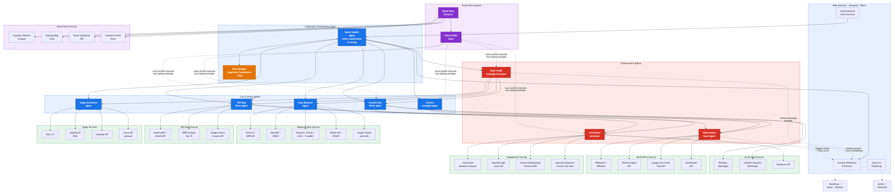

# ContentBlitz — AI Content Marketing Assistant

A production-grade multi-agent system that generates research reports, SEO blog posts, LinkedIn posts, and images from natural language requests — with one-click publishing to Ghost CMS and Squarespace. Built with LangGraph, OpenAI, Anthropic Claude, Tavily AI, and DALL-E 3.

## Architecture



```
START → Query Handler
          │
          ├─[Content Safety Guardrail]
          │   └─ UNSAFE → END  (graceful rejection message)
          │
          └─ SAFE → [route by intent]
                ├─ "research"  → Deep Research → Content Strategist → END
                ├─ "blog"      → Deep Research → SEO Blog Writer → Hallucination Guard → A/B Variant Generator → END
                ├─ "linkedin"  → Deep Research → LinkedIn Writer  → Hallucination Guard → A/B Variant Generator → END
                ├─ "image"     → Image Generation → END
                └─ "strategy"  → Deep Research → Content Strategist → END
```

### Content Safety Guardrail

Every request passes through a safety pre-check inside the Query Handler **before** intent classification and before any downstream agent runs. The check uses a dedicated LLM call with a focused safety classifier prompt (`config/prompts/content_safety.txt`).

Requests are rejected if they contain or solicit:
- NSFW, pornographic, or explicit sexual content
- Violence, gore, or graphic harm
- Hate speech or discrimination
- Instructions for illegal activities
- Self-harm or suicide promotion
- Content that sexualises minors

Rejected requests short-circuit the entire workflow and return a graceful, user-facing message — no research, content generation, or image creation is triggered. Legitimate but sensitive topics (medical, legal, political research, regulated industries) are intentionally **not** blocked.

### Agents

| Agent | Purpose |
|---|---|
| **Query Handler** | Content safety pre-check, then intent classification into 5 categories (blog, linkedin, research, image, strategy) + structured routing |
| **Deep Research** | Multi-query Tavily search, URL deduplication, LLM synthesis with key findings |
| **SEO Blog Writer** | 1200–1800 word SEO-optimized blog posts with keyword integration and heading structure |
| **LinkedIn Writer** | Engagement-optimized professional posts with hook types, hashtags, and CTA |
| **Image Generation** | LLM-powered prompt engineering → DALL-E 3 with Stability AI fallback |
| **Content Strategist** | Structured strategy reports with executive summaries, sections, and data points |
| **Hallucination Guard** | Extracts factual claims from content, verifies each against research sources, computes trust score (0–100) |
| **A/B Variant Generator** | Creates 3–5 headline/hook variants (question, statistic, story, provocation, contrast), scores each on 5 engagement dimensions (0–100) |

### Technology Stack

| Component | Primary | Fallback |
|---|---|---|
| LLM | OpenAI GPT-4o | Anthropic Claude Sonnet |
| Search | Tavily AI (advanced depth) | — |
| Image Gen | DALL-E 3 | Stability AI (SDXL) |
| Blog Publishing | Ghost CMS (Admin API + JWT) | Squarespace (Bearer token) |
| Orchestration | LangGraph StateGraph | — |
| UI | Streamlit (chat + tabbed preview) | — |
| Auth | Google OAuth (production) | — |
| State Persistence | Redis via Memorystore (prod) | In-memory (dev) |
| Logging | structlog (JSON prod / console dev) | — |
| Resilience | Circuit breaker per provider | Automatic fallback chains |

### Resilience: Circuit Breaker

All external API clients are protected by a shared **circuit breaker registry** that prevents cascading failures:

```
CLOSED ──(N consecutive failures)──▶ OPEN ──(timeout expires)──▶ HALF_OPEN
  ▲                                     ▲                            │
  └────────(probe succeeds)─────────────└───(probe fails)────────────┘
```

| Provider | When circuit opens | Behavior |
|---|---|---|
| OpenAI (LLM) | 5 failures in a row | Skips to Anthropic fallback |
| Anthropic (LLM) | 5 failures in a row | `LLMFallbackExhausted` error |
| DALL-E 3 | 5 failures in a row | Falls back to Stability AI |
| Stability AI | 5 failures in a row | `ImageGenerationError` |
| Tavily | 5 failures in a row | Returns empty results (graceful degradation) |

Circuits auto-recover after 60 seconds via a half-open probe. Content policy violations (e.g., DALL-E safety filters) do not trip the breaker.

## Quick Start

### Prerequisites

- Python 3.11+
- API keys: OpenAI, Tavily (required); Anthropic, Stability AI (optional fallbacks)

### Setup

```bash
# Clone and enter project
cd ContentBlitz

# Create virtual environment
python -m venv .venv
source .venv/bin/activate

# Install dependencies
pip install -r requirements.txt

# Configure API keys
cp .env.example .env
# Edit .env with your API keys

# Run the web app
make run
# Or: streamlit run src/web_app/app.py
```

The app will be available at http://localhost:8501.

### Docker

```bash
# Copy and configure env
cp .env.example .env
# Edit .env with your API keys

# Start with Docker Compose
docker compose up --build -d

# View logs
docker compose logs -f app

# Stop
docker compose down
```

### CLI Usage

```bash
python -m src.main "Write a blog post about AI in healthcare"
python -m src.main "Create a LinkedIn post about remote work trends"
python -m src.main "Research the latest in quantum computing"
python -m src.main "Generate an image for sustainable energy"
```

## Project Structure

```
contentblitz/
├── src/
│   ├── agents/              # 8 specialized agents (BaseAgent ABC pattern)
│   │   ├── base_agent.py    # Abstract base with run() wrapper, prompt loading
│   │   ├── query_handler.py # Intent classification → 5 categories
│   │   ├── deep_research.py # Multi-query search + LLM synthesis
│   │   ├── seo_blog_writer.py
│   │   ├── linkedin_writer.py
│   │   ├── image_generation.py
│   │   ├── content_strategist.py
│   │   ├── hallucination_guard.py
│   │   └── ab_variant_generator.py  # A/B headline/hook variants with scoring
│   ├── core/                # Config, state, models, exceptions
│   │   ├── config.py        # Pydantic Settings with env loading
│   │   ├── state.py         # ContentState TypedDict with annotated reducers
│   │   ├── models.py        # Pydantic models (10 typed outputs)
│   │   └── exceptions.py    # ContentBlitzError hierarchy (6 types)
│   ├── integrations/        # API clients with circuit breakers
│   │   ├── circuit_breaker.py  # Per-provider circuit breaker + registry
│   │   ├── llm_client.py       # OpenAI → Anthropic fallback with breakers
│   │   ├── tavily_client.py    # Tavily search with breaker
│   │   ├── openai_image_client.py  # DALL-E 3 with breaker
│   │   ├── stability_client.py     # Stability AI with breaker
│   │   ├── wikipedia_client.py     # Fact verification
│   │   ├── ghost_client.py         # Ghost CMS Admin API (JWT auth, markdown→HTML)
│   │   ├── squarespace_client.py   # Squarespace blog publishing (Bearer token)
│   │   └── base_client.py         # httpx ABC with retry + exponential backoff
│   ├── workflow/            # LangGraph graph definition
│   │   ├── graph.py         # build_graph() — StateGraph + shared breaker registry
│   │   ├── nodes.py         # Thin async node wrappers
│   │   └── conditions.py    # 3 routing functions (intent, research, content)
│   ├── utils/               # Quality tools
│   │   ├── logging_config.py     # structlog setup (JSON / console)
│   │   ├── content_optimizer.py  # SEO scoring (7-factor, 100-point scale)
│   │   ├── quality_validator.py  # Blog + LinkedIn validation
│   │   └── text_processing.py    # Markdown cleanup, truncation, word count
│   └── web_app/             # Streamlit UI
│       ├── app.py           # Main app with chat + preview columns
│       ├── components/      # Sidebar, chat, content preview, research panel
│       └── styles/custom.css
├── config/
│   ├── prompts/             # 9 externalized system prompts (one per agent + content_safety)
│   └── settings.yaml        # Default configuration values
├── tests/                   # 99 unit + integration tests
│   ├── unit/                # 14 test files (agents, core, utils, circuit breaker)
│   ├── integration/         # 3 test files (workflows, fallback chains)
│   └── conftest.py          # Shared fixtures
├── evals/                   # 132 evaluation tests
│   ├── eval_intent_classification.py  # 60 queries × 5 intents
│   ├── eval_hallucination_guard.py    # 8 scenarios + edge cases + live LLM
│   ├── eval_workflow_robustness.py    # 20 end-to-end workflow cases
│   └── data/                # JSON datasets (intent, hallucination, workflow)
├── docs/                    # Architecture diagrams (HTML + PNG)
├── Dockerfile               # Multi-stage production image
├── docker-compose.yml       # App + Redis
├── Makefile                 # 12 convenience targets
├── pyproject.toml           # pytest, ruff, mypy config
├── requirements.txt         # 25 production dependencies
└── requirements-dev.txt     # Test + lint dependencies
```

## Configuration

All settings can be overridden via environment variables:

| Variable | Default | Description |
|---|---|---|
| `OPENAI_API_KEY` | — | Required for primary LLM + DALL-E 3 |
| `ANTHROPIC_API_KEY` | — | Fallback LLM provider |
| `TAVILY_API_KEY` | — | Required for web research |
| `STABILITY_API_KEY` | — | Fallback image generation |
| `OPENAI_MODEL` | `gpt-4o` | Primary LLM model |
| `ANTHROPIC_MODEL` | `claude-sonnet-4-20250514` | Fallback LLM model |
| `LOG_LEVEL` | `INFO` | Logging verbosity |
| `ENVIRONMENT` | `development` | `development` (console logs) or `production` (JSON logs) |
| `GHOST_ADMIN_API_KEY` | — | Ghost Admin API key (`id:secret` format) — leave blank to hide button |
| `GHOST_API_URL` | `https://the-algorithmic-lens.ghost.io` | Ghost instance URL (use the `.ghost.io` URL, not custom domain) |
| `SQUARESPACE_API_KEY` | — | Squarespace Developer API key — leave blank to hide button |
| `SQUARESPACE_SITE_URL` | — | Squarespace site URL |
| `SQUARESPACE_BLOG_COLLECTION_ID` | — | Squarespace blog collection ID |
| `GOOGLE_CLIENT_ID` | — | Google OAuth client ID (production auth gate) |
| `GOOGLE_CLIENT_SECRET` | — | Google OAuth client secret |
| `REDIS_URL` | — | Redis URL for state persistence (production) |
| `API_TIMEOUT` | `60.0` | Timeout for all API calls (seconds) |
| `MAX_RETRIES` | `3` | Retry count for HTTP clients |

System prompts are in `config/prompts/*.txt` and can be tuned without code changes.

## Testing

```bash
# Run all tests (unit + integration)
make test

# Unit tests only
make test-unit

# Integration tests only
make test-integration

# With coverage report
make test-cov

# Run evals (mocked, no API key needed)
make eval

# Run live evals against real LLM (requires OPENAI_API_KEY)
OPENAI_API_KEY=sk-... pytest evals/ -v -k live --tb=short

# Everything (tests + evals)
pytest tests/ evals/ -v
```

### Test Summary

| Category | Tests | What it covers |
|---|---|---|
| Unit tests | 99 | All 8 agents, circuit breaker, routing conditions, config, SEO optimizer, quality validator, LLM client fallback, state management |
| Integration tests | 3 | End-to-end blog workflow, research workflow, LLM fallback chains |
| Eval: Intent Classification | 65 | 60 queries across 5 intents + edge cases + dataset balance checks |
| Eval: Workflow Robustness | 24 | 20 diverse queries through full pipeline + error recovery + empty query |
| Eval: Hallucination Guard | 20 | 8 scenarios (verified/fabricated/contradicted/mixed) + edge cases + trust score math |
| **Total** | **231** | |

## Key Design Decisions

1. **Content Safety Guardrail**: LLM-based safety pre-check fires inside the Query Handler before any other agent runs. Unsafe requests short-circuit the graph immediately with a graceful rejection message — zero downstream API calls are made. The classifier prompt (`config/prompts/content_safety.txt`) is externalized for easy tuning
2. **LLM Fallback Chain**: OpenAI → Anthropic automatic failover with structured logging of fallback events
3. **Circuit Breaker per Provider**: Prevents cascading failures. 5-failure threshold opens the circuit; 60-second recovery timeout probes with a single request before closing. Shared registry across all clients
4. **Image Fallback**: DALL-E 3 → Stability AI with same prompt. Content policy violations don't trip the breaker
5. **Externalized Prompts**: System prompts in `config/prompts/` for easy tuning without code changes
6. **Hallucination Guard**: Closed-loop verification — extracts factual claims from generated content, verifies each against the research sources that produced it, returns trust score + flagged claims
7. **Sequential Workflow**: Agents run sequentially through LangGraph for simplicity and debuggability. Each writes to its own state key with no conflicts
8. **Structured Logging**: structlog with JSON output in production for log aggregation, colored console in development. Every agent logs start/complete/error with timing
9. **Typed State**: `ContentState` is a `TypedDict` with `Annotated` fields and custom reducers for list merging (errors, processing_log)
10. **Pydantic Models**: 10 typed output models ensure structured data flows between agents without runtime type errors
11. **CMS Publishing**: Ghost (JWT-authenticated Admin API) and Squarespace (Bearer token) integration with draft/publish toggle. Buttons auto-hide when keys aren't configured — zero UI clutter for users who don't need them
12. **Google OAuth Gate**: Production deployments are protected by Google OAuth SSO. Auth is disabled in development when credentials aren't configured

## Evaluation Criteria Coverage

| Criteria | Weight | Implementation |
|---|---|---|
| Multi-Agent Architecture | 25% | 8 specialized agents with clear separation, BaseAgent ABC pattern, typed state |
| LangGraph Workflow | 10% | StateGraph with 3 conditional routing edges, typed ContentState |
| Service Integration | 5% | OpenAI + Anthropic fallback, DALL-E + Stability fallback, Tavily search, Ghost + Squarespace CMS publishing, circuit breakers |
| Content Quality Pipeline | 5% | SEO scorer (7-factor), quality validator, Hallucination Guard with trust score |
| Research Quality | 10% | Multi-query Tavily search, URL deduplication, LLM synthesis with key findings |
| Content Optimization | 10% | SEO scoring (100-point scale), keyword density, readability, heading structure |
| Visual Content | 5% | DALL-E 3 with LLM prompt engineering, Stability AI fallback |
| Interface Design | 7% | Streamlit with chat + tabbed preview + research sidebar + API status |
| Conversation Flow | 3% | Chat interface with message history, processing log display |
| Code Organization | 4% | Modular architecture, type hints, Pydantic models, clean imports |
| Documentation | 3% | README + architecture diagrams + inline docstrings |
| Testing & Evals | 3% | 231 tests (unit + integration + evals), circuit breaker tests, live LLM evals |

## CMS Publishing

ContentBlitz can publish blog posts directly to your CMS with a single click. Both Ghost and Squarespace are supported — buttons appear automatically when the corresponding API keys are configured.

### Ghost CMS

1. In Ghost Admin, go to **Settings → Integrations → Add Custom Integration**
2. Name it `ContentBlitz` and copy the **Admin API Key** (format: `id:secret`)
3. Set in `.env`:
   ```
   GHOST_ADMIN_API_KEY=64abc123def456:a1b2c3d4e5f6...
   GHOST_API_URL=https://your-site.ghost.io
   ```
4. **Important:** Use the canonical `.ghost.io` URL, not a custom domain — Ghost redirects API calls from custom domains

### Squarespace

1. In Squarespace Admin, go to **Settings → Advanced → Developer API Keys**
2. Generate a key and copy it
3. Set in `.env`:
   ```
   SQUARESPACE_API_KEY=your-key
   SQUARESPACE_SITE_URL=https://your-site.com
   SQUARESPACE_BLOG_COLLECTION_ID=your-collection-id
   ```

Both publishers support **draft mode** (default) or immediate publishing, and convert Markdown to HTML automatically.

## Future Enhancements

- Multi-modal Campaign Generator (blog + LinkedIn + image as one coordinated package)
- Brand Voice Extraction from user's existing content (website, blog archive, LinkedIn posts)
- External engagement scoring APIs (CoSchedule, Sharethrough, BuzzSumo) to supplement LLM-based scoring
- Additional CMS targets (WordPress, Medium, Substack)
- Social media scheduling (Buffer, Hootsuite)
- Content analytics and engagement tracking
